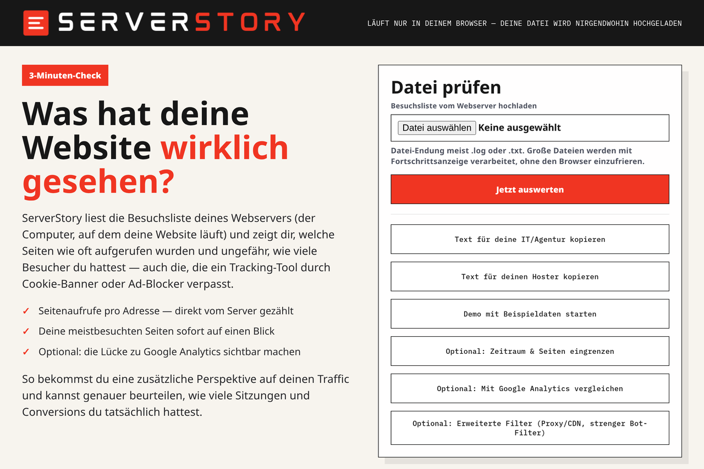

# ServerStory

Sieh in wenigen Minuten, was deine Website laut deinen Server-Logs **wirklich** an
Seitenaufrufen (und ungefähr an Besuchern) hatte — direkt aus der Quelle, ohne Cookies
und ohne Tracking-Tool. Optional kannst du die Zahlen direkt mit Google Analytics
vergleichen und siehst sofort, ob Google Analytics weniger zählt als die Realität.

**Alles läuft lokal in deinem Browser. Deine Logdatei wird nirgendwohin hochgeladen.**

Du brauchst kein Programm, keinen Account und keine Installation — nur einen Browser
(Chrome, Edge, Firefox oder Safari).



---

## 1. Tool herunterladen

> **Schon als ZIP-Datei bekommen?** Wenn du ServerStory per E-Mail oder Link als
> ZIP-Datei erhalten hast, überspring diesen Schritt und mach direkt bei
> **Schritt 2 (Entpacken)** weiter.

So lädst du es von dieser Seite herunter:

1. Klicke oben auf dieser Seite auf den grünen Button **`< > Code`**.
2. In dem kleinen Menü, das aufklappt, auf **`Download ZIP`** klicken.
3. Es wird eine Datei namens `ServerStory-main.zip` in deinen Download-Ordner geladen.

## 2. Entpacken

Die heruntergeladene ZIP-Datei muss einmal „ausgepackt" werden:

- **Windows:** Rechtsklick auf die ZIP-Datei → **„Alle extrahieren…"** → **„Extrahieren"**.
- **Mac:** Doppelklick auf die ZIP-Datei.

Danach hast du einen ganz normalen Ordner mit den Dateien darin.

## 3. Öffnen und auswerten

1. Öffne den entpackten Ordner und mach einen Doppelklick auf die Datei
   **`START_HIER.html`** — sie öffnet sich in deinem Browser.
2. Klicke auf **„Datei auswählen"** und wähle deine **Logdatei** aus. Das ist die
   Besuchsliste deines Webservers, meist eine Datei mit der Endung `.log`, `.txt` oder
   `.gz`.
3. Klicke auf **„Jetzt auswerten"**.

Du siehst sofort deine meistbesuchten Seiten und — als Richtwert — wie viele Besucher du
im gewählten Zeitraum hattest.

> **Sehr große Logdatei?** Kein Problem — die Datei wird zeilenweise mit Fortschritts-
> anzeige verarbeitet und friert den Browser nicht ein. Komprimierte `.gz`-Dateien kann
> ServerStory in modernen Browsern direkt lesen. Nur bei vielen Millionen Zeilen kann es
> ein paar Sekunden dauern.

---

## Du hast keine Logdatei?

Die Logdatei liegt auf dem Server, auf dem deine Website läuft — meist hat sie deine
IT-Abteilung oder deine Agentur.

Damit du nicht lange erklären musst, gibt es im Tool zwei fertige Vorlagen:
**„Text für deine IT/Agentur kopieren"** und **„Text für deinen Hoster kopieren"**. Ein
Klick kopiert den passenden Text — den schickst du an deine IT bzw. an deinen
Hoster-Support, und die Gegenseite weiß genau, welche Datei du brauchst und wie sie sie
exportiert.

**Erst mal ausprobieren?** Klicke im Tool auf **„Demo mit Beispieldaten starten"** —
dann siehst du an Beispielzahlen, wie das Ergebnis aussieht, ganz ohne eigene Datei.

## Optional: mit Google Analytics vergleichen

Klappe im Tool den Bereich **„Optional: Mit Google Analytics vergleichen"** auf und
trag deine Google-Analytics-Zahlen ein. ServerStory stellt sie dann deinen echten
Server-Zahlen gegenüber und zeigt dir, ob Google Analytics weniger zählt — zum
Beispiel, weil Ad-Blocker oder abgelehnte Cookies einen Teil der Besuche verschlucken.

Damit der Vergleich belastbar ist, sollten Logdatei und Google-Analytics-Auswertung
denselben Zeitraum abdecken. Vergleiche außerdem immer dieselbe Metrik: ServerStorys
Seitenzahlen sind **Server-Aufrufe**, keine GA4-„Nutzer". Am besten exportierst oder
kopierst du aus GA4 die Seitenpfade mit den jeweiligen Aufrufen. Neben manuell
eingefügten Zeilen sollte ServerStory auch typische CSV- oder TSV-Exporte aus GA4 bzw.
Google Sheets erkennen: eine Spalte mit dem Seitenpfad oder der Seiten-URL und eine
Spalte mit den Aufrufen. Wichtig ist, dass du nicht versehentlich Nutzer, Sitzungen oder
Ereignisse mit Server-Aufrufen vergleichst.

ServerStory vereinheitlicht typische Schreibweisen wie `/seite` und `/seite/`, aber
unterschiedliche Hosts, Filter in GA4 oder stark gecachte Seiten können den Vergleich
trotzdem verzerren. Wenn deine Website mehrere Domains oder Subdomains im selben Log
hat, solltest du denselben Host auswerten, den du auch in GA4 betrachtest.

## Belastbarkeit der Befunde

ServerStory soll keine falsche Sicherheit erzeugen. Wenn eine Zahl rechnerisch
ermittelbar ist, aber die Datenbasis schwach wirkt, markiert das Tool den Befund als
mittel oder niedrig belastbar und nennt den konkreten Grund.

Direkt neben den wichtigsten Kennzahlen stehen deshalb Ampeln und Kurzgruende fuer:

- Seitenaufrufe
- Besucher
- Conversions/Kaeufe
- GA4-Abgleich
- Host-Scope
- Bot-/Anomalie-Erkennung
- Tracking-Speicher

Typische Gruende sind zum Beispiel: viele Zugriffe von einer Proxy-IP, fehlendes oder
nicht plausibles X-Forwarded-For, mehrere Hosts in einer Datei, niedrige
Recognition-Rate, unsortierte Logs, falsche GA4-Metrik, unlesbarer GA4-Export oder ein
erreichtes Tracking-Speicherlimit. Der Copy-Report exportiert dieselbe Unsicherheit
maschinenlesbar, unter anderem mit `visitorRange`, `visitorReliability`,
`accuracyNotes`, `proxyKind`, `recognitionRate` und `hostReliability`.

## Entwicklung und Qualitätssicherung

Wenn du am Tool etwas änderst, nutze das komplette Prüf-Gate:

```bash
npm run verify
```

Das Gate baut `index.html` aus `src/`, prüft Syntax, Parser-/Render-Tests,
Sanitizer-Test, Browser-E2E, Firefox-Render, CSP-/Build-Platzhalter und Repo-Hygiene.

Wichtige Einzelbefehle:

```bash
npm test              # Parser-, Diagnose-, Snapshot- und Render-Tests
npm run test:e2e      # echter Browserflow mit Upload, Preflight, Report, Demo, XFF, Hostfilter, .gz
npm run test:sanitize # Log-Sanitizer pruefen
npm run audit:repo    # keine echten Logs/Archive/PII versehentlich im Repo
```

Die Testdateien liegen unter `tests/fixtures/`. Dokumentationsnahe Provider-Beispiele
liegen unter `tests/fixtures/provider-docs/` und decken CloudFront, Cloudflare Logpush,
IIS/W3C und Fastly-nahe Formate ab. Akamai wird ueber eine eigene Feldnamen-Matrix
unter `tests/fixtures/akamai-matrix.jsonl` abgesichert.

Das Analyse-Protokoll ist versioniert (`serverstory.analysis.v1`) und hat einen stabilen
Snapshot unter `tests/snapshots/analysis-report-v1.json`. Die Felder sind in
`docs/report-schema-v1.md` beschrieben. Wichtige Genauigkeitsgrenzen stehen in
`docs/accuracy-limits.md`; die Release-Schritte in `docs/release-checklist.md`.

## Echte Logs anonymisieren

Echte Server-Logs können IP-Adressen, Hosts, E-Mail-Adressen oder Tokens enthalten.
Lege solche Dateien nur lokal in `serverstory-logs/` ab; dieser Ordner ist per
`.gitignore` ausgeschlossen.

Zum Erzeugen eines anonymisierten Snippets:

```bash
node scripts/sanitize-log.js serverstory-logs/original.log serverstory-logs/anonymized.log
```

Der Sanitizer ersetzt IPs und Hosts durch Dokumentationswerte, maskiert E-Mails und
entfernt riskante Query-Parameter wie `email`, `name`, `user`, `token` oder `session`.
Außerdem maskiert er Cookie-/Authorization-Felder und lange ID-artige Pfadsegmente.
Danach trotzdem kurz manuell prüfen, bevor ein Snippet als Testfixture übernommen wird.

## Robustheits-Ausbau: Punkte 5-10

Diese Punkte beschreiben, wie ServerStory Befunde noch robuster machen soll. Sie sind
bewusst aus Nutzer- und Entwicklersicht formuliert: Nutzer sollen verstehen, wie
belastbar eine Zahl ist; Entwickler sollen sehen, welche Regeln und Grenzen im Code
explizit bleiben müssen.

### 5. Sichtbare Kennzahl-Ampeln

Jede zentrale Kennzahl sollte eine eigene Belastbarkeits-Ampel bekommen:

- **Seitenaufrufe:** abhängig von Logformat-Erkennung, Parse-Rate, Hostfilter und
  CDN-/Cache-Risiko.
- **Besucher:** abhängig von IP-Qualität, X-Forwarded-For, Proxy-Signalen,
  Chronologie und auffälligen Besucher-Schlüsseln.
- **Conversions/Käufe:** abhängig von eindeutiger Erfolgs-URL, Pattern-Match,
  Order-ID-Deduplizierung und Reload-Risiko.
- **GA4-Vergleich:** abhängig von Zeitraum, Host, URL-Normalisierung, importierter
  Metrik und gemeinsamer Seitenabdeckung.

Die Ampel ist keine Dekoration, sondern Teil des Befunds. Eine Zahl kann rechnerisch
korrekt sein und trotzdem nur gelb oder rot bewertet werden, wenn die Datenquelle dafür
zu schwach ist. Beispiel: Seitenaufrufe können grün sein, während Besucher gelb sind,
weil alle Requests über einen Proxy laufen.

Aus Entwicklersicht sollten Ampeln aus demselben `diagnostics`-/Reliability-Modell
kommen wie das Analyse-Protokoll. Es darf keine zweite, abweichende Logik nur für die UI
geben. Jede Ampel braucht außerdem eine kurze Begründung, damit der Nutzer nicht nur
„Gelb" sieht, sondern weiß, welches Signal die Bewertung verschlechtert hat.

### 6. Edge-CDN-Formate und Grenzen

Origin-Logs und Edge-Logs beantworten unterschiedliche Fragen:

- **Origin-Log:** Was hat den Webserver erreicht?
- **Edge-/CDN-Log:** Was wurde am CDN-Rand an Nutzer ausgeliefert?

Für maximale Präzision sollte ServerStory native Parser für typische Edge-Formate
unterstützen, insbesondere Cloudflare Logpush JSON, Fastly-Logs, Akamai-Logs,
AWS CloudFront Standard/Realtime Logs und AWS ALB-Logs. Diese Parser müssen ihr Format
klar melden und dürfen nicht stillschweigend mit klassischen Apache-/Nginx-Origin-Logs
vermischt werden.

Wichtig bleibt die Grenze: Wenn nur ein Origin-Log vorliegt, kann ServerStory
CDN-Cache-Hits nicht rekonstruieren. Das Tool sollte solche Befunde deshalb als
Mindestwert kennzeichnen. Wenn ein Edge-Log vorliegt, können Seitenaufrufe vollständiger
sein, aber Besucher- und Bot-Bewertung hängen dann von den dort vorhandenen Feldern ab
zum Beispiel Client-IP, User-Agent, Cache-Status, Host, Path und Edge-Response-Status.

### 7. Konfigurierbare Bot-/Anomalie-Schwellen

Die Bot- und Anomalie-Erkennung sollte mit sinnvollen Standardwerten starten, aber im
erweiterten Bereich konfigurierbar sein. Relevante Schwellen sind zum Beispiel:

- Bot-Verdacht ab einer bestimmten Zahl von Seitenaufrufen pro Besucher-Schlüssel.
- Verdacht bei sehr niedrigem Asset-Anteil.
- Optionaler strenger Browserfilter.
- Zeitfenster für auffällige Frequenzmuster.
- Behandlung leerer oder ungewöhnlicher User-Agents.

Für Nutzer sollte der Standardmodus ohne Fachwissen funktionieren. Für Entwickler ist
wichtig: Jede verwendete Schwelle gehört ins Analyse-Protokoll. Nur so kann man später
nachvollziehen, warum ein Client als verdächtig markiert oder gefiltert wurde.

### 8. Large-file- und Sampling-Schutz

ServerStory soll sehr große Dateien weiter lokal verarbeiten, ohne den Browser unnötig
zu belasten. Dafür braucht es klare Schutzmechanismen:

- Streaming-Verarbeitung statt vollständigem Einlesen, wo der Browser es erlaubt.
- Obergrenzen für große Maps wie Besucher-Schlüssel, Top-IP-Tracking und Path-Counts.
- Hinweise, wenn eine interne Grenze erreicht wurde.
- Preflight-Sampling vor der Vollanalyse.
- Optional Approximationen für sehr große Dateien, statt so zu tun, als seien alle
  Detaildaten vollständig im Speicher.

Aus Nutzersicht muss sichtbar bleiben, ob eine Zahl exakt aus allen Zeilen stammt oder
ob eine Schutzgrenze die Detailtiefe eingeschränkt hat. Seitenaufrufe können auch bei
gekappter Detailanalyse noch brauchbar sein; Besucher, Top-Clients oder
Anomalie-Befunde können dadurch aber an Belastbarkeit verlieren.

### 9. Parser-Fuzzing

Die normalen Regressionstests prüfen bekannte Fälle. Zusätzlich sollte der Parser mit
kaputten, ungewöhnlichen und extremen Zeilen getestet werden:

- sehr lange URLs, User-Agents und Referrer,
- fehlende Felder,
- ungültige Zeitstempel,
- gemischte Encodings,
- JSON-Zeilen mit unbekannten Feldern,
- IIS/W3C-Zeilen mit veränderter Feldreihenfolge,
- IPv4, IPv6, Ports und X-Forwarded-For-Listen,
- unvollständige oder abgeschnittene Logzeilen.

Das Ziel von Fuzzing ist nicht, jede Zeile irgendwie zu retten. Das Ziel ist, dass
ServerStory bei schlechten Eingaben stabil bleibt, keine falschen Zahlen erfindet und
nicht erkannte Zeilen sauber als Qualitätsrisiko meldet.

### 10. Separater Build und Source-Struktur

Für Nutzer ist eine einzelne HTML-Datei weiterhin ideal. Für Entwicklung und Qualität
sollte der Quellcode trotzdem getrennt werden:

- `src/parser.js` für Logparser und Normalisierung.
- `src/aggregator.js` für Zählung, Sessions, Conversions und Diagnostics.
- `src/ga4.js` für GA4-/CSV-/TSV-Import.
- `src/render.js` für UI-Ausgabe.
- `src/worker.js` für Worker-Verarbeitung.
- `src/styles.css` für das Styling.
- `tests/` gegen die Source-Module, nicht gegen herausgeschnittenes HTML-Script.

Ein Build-Schritt kann daraus weiterhin eine portable `index.html` erzeugen. Damit
bleibt die Distribution einfach, während Parser, Tests und UI weniger eng miteinander
verkoppelt sind. Diese Trennung senkt das Risiko, dass eine UI-Änderung die
Auswertungslogik beschädigt oder dass Parser-Fixes schwer testbar bleiben.

## Wie genau ist das?

ServerStory zeigt, was bei deinem Server **tatsächlich ankommt** — Cookie-Banner und
Ad-Blocker können das nicht verstecken. Die wichtigsten Zahlen sind aber nicht alle gleich
belastbar:

- **Seitenaufrufe:** am präzisesten, solange das Logformat erkannt wird und die Aufrufe
  wirklich im ausgewerteten Server-Log landen.
- **Beliebteste Seiten:** sehr belastbar, wenn URLs sauber normalisiert werden und keine
  relevanten Aufrufe durch CDN- oder Browser-Caching fehlen.
- **Besucher:** immer eine Schätzung, weil Server-Logs keine Personen-ID enthalten.
- **Conversions/Käufe:** meist belastbar, wenn die Danke-/Erfolgsseite eindeutig ist und
  nicht gecacht wird.
- **GA4-Abweichung:** belastbar, wenn Zeitraum, Seitenpfade und Metrik wirklich
  zusammenpassen.

ServerStory gibt deshalb nicht nur Zahlen aus, sondern auch Hinweise zur Datenqualität:
erkannte Logformate, nicht erkannte Zeilen, Chronologieprobleme, Proxy-/CDN-Signale,
X-Forwarded-For-Nutzung und andere Warnungen beeinflussen, wie stark du einer Kennzahl
vertrauen solltest.

### Logformat-Unterstützung

Am zuverlässigsten arbeitet ServerStory mit klassischen Apache-/Nginx-Zugriffslogs im
Combined-Log-Format, also Zeilen mit IP-Adresse, Zeitstempel, Request, Statuscode,
Referrer und User-Agent. Komprimierte `.gz`-Varianten dieser Logs können in modernen
Browsern direkt ausgewertet werden.

ServerStory prüft die ersten Zeilen vor der eigentlichen Auswertung und meldet, ob das
Format plausibel erkannt wurde. Diese Formatvorschau sollte dir beispielhaft zeigen, was
aus dem Log gelesen wird: IP-Adresse, Zeitpunkt, Methode, URL, Statuscode, Host,
Referrer und User-Agent. Wenn diese Vorschau sichtbar falsch aussieht, solltest du die
Analyse nicht als belastbar verwenden, sondern ein passenderes Logformat exportieren.

Apache-/Nginx-Combined-Logs werden am sichersten ausgewertet. Einfache JSON-Logs und
IIS/W3C-Logs kann ServerStory ebenfalls lesen, sofern die üblichen Feldnamen bzw.
`#Fields`-Angaben enthalten sind. Wenn ein Logformat nicht erkannt wird, wenn wichtige
Felder fehlen oder wenn viele Zeilen ausgeschlossen werden, solltest du die Ergebnisse
nur eingeschränkt verwenden und nach einem Apache-/Nginx-Combined-Export oder einem
vollständigen Edge-/CDN-Log fragen.

### Confidence und Warnungen

Eine hohe Belastbarkeit liegt vor, wenn:

- fast alle Zeilen erkannt werden,
- die Logs zeitlich sortiert sind,
- keine starke Proxy-/CDN-Verzerrung sichtbar ist,
- X-Forwarded-For korrekt genutzt wird, falls ein Proxy davor sitzt,
- Bots sinnvoll gefiltert werden,
- der GA4-Vergleich denselben Zeitraum und dieselben Seitenpfade nutzt.

Eine eingeschränkte Belastbarkeit liegt vor, wenn:

- viele Logzeilen nicht zum erwarteten Format passen,
- die Datei stark unsortiert ist,
- viele Aufrufe von wenigen Proxy- oder internen IPs kommen,
- CDN-Caching wahrscheinlich ist,
- viele Bots oder verdächtige User-Agents enthalten sind,
- GA4 andere Filter, Hostnamen oder Zeiträume nutzt.

In der Oberfläche sollten die wichtigsten Kennzahlen deshalb nicht nur als Zahlen
erscheinen, sondern mit einer einfachen Belastbarkeits-Ampel:

- **Grün:** Die Kennzahl ist für den gewählten Zweck gut belastbar.
- **Gelb:** Die Kennzahl ist brauchbar, aber mit sichtbaren Einschränkungen.
- **Rot:** Die Kennzahl ist wahrscheinlich verzerrt und sollte nicht allein als
  Entscheidungsgrundlage dienen.

Die Ampel kann je Kennzahl unterschiedlich ausfallen. Seitenaufrufe können zum Beispiel
grün sein, während Besucher gelb sind, weil ein Proxy davor sitzt. Der GA4-Vergleich kann
rot sein, obwohl die Server-Zahlen selbst sauber sind, wenn Zeitraum, Host oder Metrik in
GA4 nicht zur Logdatei passen.

**Aufrufe vs. Besucher.** Jeden Aufruf, der bei deinem Server ankommt, zählt er genau mit
— eine Logzeile pro Aufruf. (Ob *alle* Aufrufe ankommen, hängt vom Caching ab — dazu
gleich.) Wie viele *verschiedene Menschen* das waren (Besucher), steht dagegen nicht im
Log und ist eine Schätzung: Aufrufe werden per IP und Browser zu Personen zusammengefasst
(eine Person = mehrere Aufrufe, eine Firma = ein Besucher). Der Seiten-Vergleich
vergleicht nur **Aufrufe gegen Aufrufe** und braucht die Besucherzahl gar nicht.

Die Besucherzahl solltest du deshalb als Größenordnung lesen, nicht als exakte
Personenzahl. Sie wird genauer, wenn echte Besucher-IPs im Log stehen, User-Agents
vorhanden sind und die Datei ungefähr chronologisch sortiert ist. Sie wird ungenauer bei
Firmennetzen, Mobilfunknetzen, gemeinsam genutzten IPs, IPv6-Privacy-Adressen,
vorgelagerten Proxys und fehlendem oder falschem X-Forwarded-For.
Wenn diese Signale schwach sind, zeigt ServerStory die Besucher nicht als harte Zahl,
sondern als Bandbreite an.

**Abweichungen gehen in beide Richtungen.** Der Vergleich zeigt nicht „die Wahrheit",
sondern *wo* sich Server und Google Analytics unterscheiden:

- **Google Analytics zählt weniger als der Server** → meist Tracking-Verlust: abgelehnte
  Cookies, Ad-Blocker, nicht geladenes Skript.
- **Der Server zählt weniger als Google Analytics** → meist Caching/CDN: liegt deine
  Seite hinter Cloudflare, Fastly o. Ä. (oder im Browser-Cache), wird ein Teil der
  Aufrufe aus dem Cache ausgeliefert und erreicht das Origin-Log nie — das GA-Skript
  feuert trotzdem. (Auch Mehrfachzählung oder Bots können Google Analytics aufblähen.)

**Käufe** sind davon kaum betroffen: Eine Danke-Seite nach dem Kauf wird typischerweise
nicht gecacht (dynamisch, pro Bestellung) und erreicht den Server zuverlässig — der
Kauf-Vergleich bleibt belastbar.

Wenn eine Erfolgsseite mehrmals neu geladen wird, kann sie trotzdem mehrfach im Log
stehen. ServerStory versucht solche Wiederholungen zu entschärfen, aber die höchste
Präzision erreichst du mit einer eindeutigen, nicht gecachten Danke-Seite und einem
klaren URL-Muster. Wenn deine Danke-Seite eine Bestellnummer in der URL enthält, kannst
du den Parameter im Tool angeben; dann dedupliziert ServerStory Käufe anhand dieser
Order-ID statt nur anhand von IP, Browser und Zeitfenster.

**Bots.** ServerStory erkennt Bots und Crawler an ihrem User-Agent (Googlebot,
Monitoring, Skript-Tools usw.) und filtert sie heraus. Bots, die sich gezielt als echter
Browser tarnen, lassen sich so nicht zu 100 % aussortieren — das gilt aber genauso für
Google Analytics. Wenn du den Verdacht auf viel getarnten Bot-Traffic hast, hilft der
strenge Filter unter den erweiterten Filtern (lässt nur klar als Browser erkennbare
Zugriffe durch).
Zusätzlich markiert ServerStory Besucher-Schlüssel mit sehr vielen Seitenaufrufen und
fast keinen Asset-Abrufen als verdächtig. Das ist kein harter Bot-Beweis, aber ein
nützliches Warnsignal für Monitoring, Scraper oder getarnten Bot-Traffic.

**Mehrere Domains oder Subdomains.** Viele Hosting-Setups schreiben Zugriffe auf mehrere
Hosts in dieselbe Logdatei, zum Beispiel `example.de`, `www.example.de`, eine
Staging-Domain oder alte Weiterleitungsdomains. Für belastbare Befunde sollte
ServerStory die erkannten Hosts anzeigen und einen Host-/Domain-Filter anbieten. Nutze
ihn, wenn du nur eine bestimmte Website, Subdomain oder Kampagnen-Domain mit GA4
vergleichen willst. Ohne Hostfilter können Seitenpfade wie `/kontakt` aus verschiedenen
Domains zusammenfallen und die Top-Seiten oder GA4-Abweichungen verfälschen.

**Sitzt du hinter einem Proxy oder CDN (z. B. Cloudflare)?** Dann steht in der ersten
Spalte deiner Logzeile die IP des Proxys, nicht die deiner Besucher — die Besucherzahl
wäre dann unbrauchbar. ServerStory erkennt es, wenn auffällig viele Zugriffe von einer
einzigen oder einer internen IP-Adresse kommen, und weist dich darauf hin. Aktiviere in
dem Fall unter den erweiterten Filtern **„X-Forwarded-For"**, damit die echte Besucher-IP
verwendet wird. (Die Seitenaufrufe sind davon nie betroffen — nur die Besucherzahl.)

Wichtig: Ein CDN kann zwei verschiedene Effekte haben. Wenn der CDN-Edge den Request an
deinen Origin-Server weiterleitet, steht der Aufruf im Origin-Log und X-Forwarded-For
hilft bei der Besucher-Schätzung. Wenn der CDN-Edge die Seite komplett aus seinem Cache
ausliefert, erreicht der Request deinen Origin-Server gar nicht. Dann fehlt dieser
Aufruf im Origin-Log; ServerStory kann ihn dort nicht rekonstruieren. In so einem Setup
sind Origin-Logs oft ein Mindestwert. Für maximale Präzision brauchst du dann zusätzlich
CDN-Logs oder eine Logdatei direkt vom Edge.

Auch Edge-Logs haben Grenzen: Cloudflare, Fastly, Akamai, CloudFront oder andere CDNs
verwenden eigene Felder, Zeitstempel und Statuscodes. Ein Origin-Log beantwortet die
Frage „Was kam beim Webserver an?", ein Edge-Log beantwortet eher „Was wurde Nutzern am
Rand des CDN ausgeliefert?". Für die robustesten Befunde sollten beide Quellen getrennt
bewertet und nicht stillschweigend vermischt werden. Wenn nur Origin-Logs vorliegen,
sollte ServerStory cached Traffic als fehlende Quelle markieren. Wenn Edge-Logs
vorliegen, sollte das erkannte CDN-Format klar angezeigt werden.

## Datenschutz

Die Auswertung passiert **ausschließlich in deinem Browser**. Es wird nichts
hochgeladen und nichts an einen Server gesendet. Angezeigt werden nur Summen — keine
IP-Adressen und keine Nutzerlisten.

**„Darf ich mir diese Daten überhaupt ansehen?" — In der Regel ja, wenn es deine
eigenen Logs sind.** Es sind die Logs deines **eigenen** Webservers; dafür bist du der
Verantwortliche im Sinne der DSGVO. Server-Logs (inklusive IP-Adressen) für den sicheren
Betrieb und für aggregierte Zugriffsstatistiken auszuwerten, lässt sich auf das
**berechtigte Interesse nach Art. 6 Abs. 1 lit. f DSGVO** stützen — das setzt eine
**Interessenabwägung** voraus (dein Statistik-/Sicherheitsinteresse gegen die Interessen
der Besucher) und dass du Server-Logs in deiner Datenschutzerklärung erwähnst. ServerStory
hilft dir dabei, datensparsam zu bleiben: Die Datei wird nur lokal verarbeitet, und
ausgegeben werden ausschließlich anonyme Summen — keine einzelnen IP-Adressen.

**Wertest du die Logs eines Kunden aus (z. B. als Agentur oder Freelancer)?** Dann ist
der Kunde der Verantwortliche und du verarbeitest die Daten in seinem Auftrag — dafür
braucht ihr einen **Auftragsverarbeitungsvertrag nach Art. 28 DSGVO**. Dass ServerStory
rein lokal läuft und nichts überträgt, erleichtert diese Vereinbarung, ersetzt sie aber nicht.

Auch die optionalen erweiterten Filter ändern daran nichts: Wenn du „X-Forwarded-For"
aktivierst, dient die darin enthaltene Besucher-IP nur lokal im Browser zum
Zusammenfassen von Besuchen — übertragen oder ausgegeben wird sie nicht.

Halte dich an die übliche Log-Hygiene: kurze Aufbewahrungsfrist, Zugriff begrenzen,
Server-Logs in der Datenschutzerklärung erwähnen und IP-Adressen nach Möglichkeit kürzen.
Das ist keine Rechtsberatung.

## Lizenz

MIT — siehe [`LICENSE`](LICENSE).
